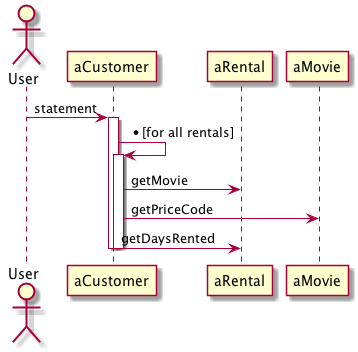

#### 重构的概念
* 什么是重构
    * 不改变代码外在行为的前提下，对代码做出修改，以改进程序的内部结构。
* "代码可以运行，千万不要去动他" 所以为什么要重构呢？
    * 唯一不变的是变化
    * 如果你发现自己需要为程序添加一个特性，而代码结构使你无法很方便地达成目的，那就先重构那个程序，使特性的添加比较容易进行，然后再添加特性

#### 动手实操

* 业务说明 ：系统根据课程租的电影，租期，计算每个顾客的消费金额和打印详单。

  * 入参：顾客，  租的影片，租期
  
  * 系统根据租凭时间和影片类型计算费用，影片分为3类，普通片，儿童片，新片
    除了计算费用，还要为常客计算积分，积分根据租片是否为新片而不同。
  
* 系统类图


##### 基础版本代码 v0
* v0代码如下
```
package chapter1.v0;

import java.util.ArrayList;
import java.util.List;


public class Customer {
    private String name;
    private List<Rental> rentals = new ArrayList<Rental>();

    public Customer(String name) {
        this.name = name;
    }


    public  void addRental(Rental rental){
        rentals.add(rental);
    }

    public String getName() {
        return name;
    }

    public String statement() {
        double totalAmount = 0;
        int frequentRenterPoints = 0;

        String result = "Rental Record for " + getName() + "\n";
        for (Rental each :rentals) {
            double thisAmount = 0;
            switch (each.getMovie().getPriceCode()) {
                case Movie.REGULAR:
                    thisAmount += 2;
                    if (each.getDaysRented() > 2) {
                        thisAmount += (each.getDaysRented() - 2) * 1.5;
                    }
                    break;
                case Movie.CHILDREN:
                    thisAmount += each.getDaysRented() * 3;
                    break;
                case Movie.NEW_RELEASE:
                    thisAmount += 1.5;
                    if (each.getDaysRented() > 3) {
                        thisAmount += (each.getDaysRented() - 3) * 1.5;
                    }
                    break;
                default:
                    break;
            }

            // add grequent renter points
            frequentRenterPoints++;
            // add bonus for a two day new release rental
            if ((each.getMovie().getPriceCode() == Movie.NEW_RELEASE) && each.getDaysRented() > 1) {
                frequentRenterPoints++;
            }

            // show fingures for this rental
            result += "\t" + each.getMovie().getTitle() + "\t" + String.valueOf(thisAmount) + "\n";
            totalAmount += thisAmount;
        }

        // add footer lines
        result += "Amount owed is " + String.valueOf(totalAmount) + "\n";
        result += "You earned " + String.valueOf(frequentRenterPoints) + " frequent renter points";
        return result;
    }
}


package chapter1.v0;

public class Movie {
    public  static final int CHILDREN = 2;
    public static final int REGULAR = 0;
    public static final int NEW_RELEASE = 1;

    private String title;
    private int priceCode;

    public Movie(String title, int priceCode) {
        this.title = title;
        this.priceCode = priceCode;
    }

    public String getTitle() {
        return title;
    }

    public void setTitle(String title) {
        this.title = title;
    }

    public int getPriceCode() {
        return priceCode;
    }

    public void setPriceCode(int priceCode) {
        this.priceCode = priceCode;
    }
}

package chapter1.v0;

public class Rental {

    private Movie movie;
    private int daysRented;

    public Rental(Movie movie, int daysRented) {
        this.movie = movie;
        this.daysRented = daysRented;
    }

    public Movie getMovie() {
        return movie;
    }

    public int getDaysRented() {
        return daysRented;
    }
}

```

* 代码可以正常运行，看起来一切都ok。可是开发中唯一不变的就是变化。终于变化来了。

###### 我们来找一下v0版本代码的问题
* 考察代码质量问题的维度：可读、可扩展、可维护、灵活、简洁、可复用、可测试等
* 落地的具体细节
  * 目录设置是否合理、模块划分是否清晰、代码结构是否满足"高内聚、松耦合"
  * 是否遵循经典的设计原则和设计思想
  * 设计模式是否应用得当 是否过度设计
  * 代码是否容易扩展，如果要添加新功能，是否容易实现
  * 代码是否可以复用 是否可以复用已有的项目代码或类库 是否有重复造论子
  * 代码是否容易测试 单元测试是否全面覆盖了各种正常和异常的情况
  * 代码是否易读 是否符合编码规范
* 从以上角度我们可以分析一下v0版本代码的问题
  > 违反了职责单一，customer的statement，打印和计算都做了。价格和积分计算都由一个方法承担<br>
  > 不容易扩展（开闭原则）：新的打印方式加不进去。新的计算价格和积分的方式加不进去

##### 第一个变化v1
* 用户希望用html格式输出详单。很简单把statement拷贝，粘贴一下，修改一下就完工了
（CV大法发挥强大用处的时候到了）。

* 恭喜第一个变化OK了，很快第二个变化来了，用户希望改变影片分类规则，
这些改变会影响客户消费和常客积分点的计算。为了应对改变，程序必须修改statement和htmlStatement。

* 随着这些小的改动越来越多，终于这个系统没有人可以维护了。这时候重构技术就该粉墨登场了。

> 如果你发现自己需要为程序添加一个特性，而代码结构使你无法很方便地达成目的，那就先重构那个程序，
使特性的添加比较容易进行，然后再添加特性。

###### 重构第一步
* 找出系统的逻辑泥团，本例就是swith语句，把他提炼到独立函数中(Extract Method)似乎比较好。

```java
...
switch (each.getMovie().getPriceCode()) {
    case Movie.REGULAR:
        thisAmount += 2;
        if (each.getDaysRented() > 2) {
            thisAmount += (each.getDaysRented() - 2) * 1.5;
        }
        break;
    case Movie.CHILDRENS:
        thisAmount += each.getDaysRented() * 3;
        break;
    case Movie.NEW_RELEASE:
        thisAmount += 1.5;
        if (each.getDaysRented() > 3) {
            thisAmount += (each.getDaysRented() - 3) * 1.5;
        }
        break;
    default:
        break;
}
... 

```

* 找到函数内的局部变量和参数，有两个 each，thisAmount。
each没有被修改，可以直接作为参数传入新的函数。thisAmount是个临时变量，
每次循环开始之前设置为0，switch之前不会变，所以可以作为新函数的返回值。
so 我们先把这个计算thisAmount的代码抽取成一个独立的函数。

```java
private double amountFor(Rental each) {
    double thisAmount = 0;
    switch (each.getMovie().getPriceCode()) {
        case Movie.REGULAR:
            thisAmount += 2;
            if (each.getDaysRented() > 2) {
                thisAmount += (each.getDaysRented() - 2) * 1.5;
            }
            break;
        case Movie.CHILDRENS:
            thisAmount += each.getDaysRented() * 3;
            break;
        case Movie.NEW_RELEASE:
            thisAmount += 1.5;
            if (each.getDaysRented() > 3) {
                thisAmount += (each.getDaysRented() - 3) * 1.5;
            }
            break;
        default:
            break;
    }
    return thisAmount;
}
```

* 再看修改好的代码，使用了来自Rental的信息，但是没有使用来自Customer的信息。这是一个信号，
"它是否放错了位置"。

> 绝大多数情况下，函数应该在它使用的数据的所属对象内。

* 回到Customer的statement方法，我们下一步要对"积分计算"部分做同样的处理。

   首先需要运用Extract Method重构手法，同样我们看一下局部变量。这里再一次
   用到了each，而它可以被当作参数传入新函数中。另一个变量frequentRenterPoints，
   在使用前已经先有了初始值，但提炼出来的函数并没有读取该值，所以不需要把
   它作为参数传递进去。
   
* 再次回到Customer的statement方法，这次我们要开始处理临时变量。运用Replace Temp with Query 。
利于查询函数来取代临时变量。
   
   1，thisAmount： 使用each.getCharge(); 直接替换。
   
   2，totalAmount：使用getTotalAmount()代替totalAmount，由于totalAmount在循环内赋值，需要把整个循环复制到查询函数中。
   
   3,frequentRenterPoints: 和totalAmount一样的处理。
   
 * 经过我们的调整，目前Customer的statement的方法现在是这样的。
 
 ```java
public String statement() {
        String result = "Rental Record for " + getName() + "\n";
        for (Rental each :rentals) {
            result += "\t" + each.getMovie().getTitle() + "\t" + String.valueOf(each.getCharge()) + "\n";
        }
        // add footer lines
        result += "Amount owed is " + String.valueOf(getTotalAmount()) + "\n";
        result += "You earned " + String.valueOf(getTotalFrequentRenterPoints()) + " frequent renter points";
        return result;
    }

    private int getTotalFrequentRenterPoints(){
        int totalFrequentRenterPoints = 0;
        for (Rental each :rentals) {
            totalFrequentRenterPoints +=  each.getFrequentRenterPoints();
        }
        return totalFrequentRenterPoints;

    }


    private double  getTotalAmount()
    {
        double totalAmount = 0;
        for (Rental each :rentals) {
            totalAmount +=  each.getCharge();
        }
        return totalAmount;
    }
```
* Rental的getCharge方法是这样的

```java
public double getCharge() {
    double thisAmount = 0;
    switch (getMovie().getPriceCode()) {
        case Movie.REGULAR:
            thisAmount += 2;
            if (getDaysRented() > 2) {
                thisAmount += (getDaysRented() - 2) * 1.5;
            }
            break;
        case Movie.CHILDRENS:
            thisAmount += getDaysRented() * 3;
            break;
        case Movie.NEW_RELEASE:
            thisAmount += 1.5;
            if (getDaysRented() > 3) {
                thisAmount += (getDaysRented() - 3) * 1.5;
            }
            break;
        default:
            break;
    }
    return thisAmount;
}
```

* Rental的getFrequentRenterPoints方法是这这样的
```java
public int getFrequentRenterPoints() {
    if ((getMovie().getPriceCode() == Movie.NEW_RELEASE) && getDaysRented() > 1) {
       return 2;
    }
    return 1;
}
```
* 这时候我们可以很方便的应对客户提出的"html格式输出详单"，其中statement里面的计算逻辑可以全部复用。

好了接下来，我们要去应对另外一个需求了，客户要修改影片分类，与之相应的积分计算规则也会发生改变。为了
应对这个变化，我们现在需要进入费用计算，积分计算方法，把因条件而异的代码替换掉（switch）。

让我们开始进入V2吧。

* 第一个问题，switch语句。最好不要在另一个对象的属性基础上运用switch语句，如果不得不用，也应该
在对象自己的数据上使用，而不是在别人的数据上使用。这个暗示了getCharge应该移动到Movie类里去。

为了计算费用，需要两项数据：租期长度，影片类型。为什么把租期长度传给Movie对象，而不是把影片类型传给Rental对象呢？

  > 因为本系统可能发生的变化是加入新影片类型，这种变化带有不稳定性。如果影片类型有变化，我们希望尽量控制它造成的影响。（隔离变化，把需要一起变化放在一起）
所以选中在Movie对象内计算费用。

调整过的Movie中的计费方法getCharge

```java
public double getCharge(int daysRented)
{
    double result = 0;
    switch (getPriceCode()) {
        case Movie.REGULAR:
            result += 2;
            if (daysRented > 2) {
                result += (daysRented - 2) * 1.5;
            }
            break;
        case Movie.CHILDRENS:
            result += daysRented * 3;
            break;
        case Movie.NEW_RELEASE:
            result += 1.5;
            if (daysRented > 3) {
                result += (daysRented - 3) * 1.5;
            }
            break;
        default:
            break;
    }
    return result;
}

```

同样的，调整过的Movie中计算积分的方法

```java
public int getFrequentRenterPoints(int daysRented)
{
    if (getPriceCode() == Movie.NEW_RELEASE && daysRented > 1) {
        return 2;
    }
    return 1;
}
```
* 看看Movie，我们有数种影片类型，它们以不同的方式回答相同的问题。这听起来很像子类的工作。
我们可以建立Movie的三个子类，每个都有自己的计费法。可以使用多态来取代switch.
  >不推荐这么干。为什么呢？？ <br>
  > 一部影片可以在生命周期内修改自己的分类，一个对象却不能在生命周期内修改自己所属的类"，


为了引入Stats模式，需要用到三个重构手法。
* 运用Replace Type Code with State/Strategy，将与类型相关到行为搬移至State模式内。
  * 针对类型代码，使用Self Encapsulate Field，确保任何时候都通过取值函数和设值函数访问类型代码。
    - 修改Movie的构造器，使用setPriceCode(priceCode);
    - 创建一个Price类，并提供类型相关的行为。在Price类中加入一个抽象函数，并在所有子类加上对应的具体函数。
    - 修改Movie类的"价格代号"访问函数，让它们使用新类。这意味着，必须在Movie内保存一个Price对象。
* 运用Move Method将switch语句移到Price类。
    
* 运用Replace Conditional with Polymorphism去掉switch语句。
    - 首先是getCharge(),取出一个case，在相应的类中建立一个覆盖函数。处理完成，修改price中的getCharge为抽象方法。

* 概括起来
  * 变化的是Move的价格和积分的计算。所有我们新建一个price抽象类，定义能力。定义不同的子类实现完成价格和积分的计算
  * Movie创建的时候，实例化不同的price子类
    * movie添加price属性。
    * setPriceCode时实例化price
  * 消除switch语句 
    * 把计算价格的代码从movie迁移到Price
    * 把每个case语句实例化成一个具体的子类
    * 所有的子类完成之后，修改price的方法为抽象方法
    
* 同样的方法处理getFrequentRenterPoints。

截止目前，我们完成了一个小小的重构。让我们用之前的标准再来审视一下v2版本的代码
> customer的statement只关心打印相关代码，计算的逻辑被移到更其他地方。职责单一了<br>
> 因为price的出现，修改价格和积分的计算变的简单和方便扩展。另外因为计算积分和价格的代码抽离了，扩展一种新的打印方式变得简单
> 单元测试是不是更容易了，每个价格的子类都比较简单，很容易全面覆盖

* 重构前后的流程图，类图

* vo

类图

<br>
流程图：


* v2

类图

<br>
流程图：

